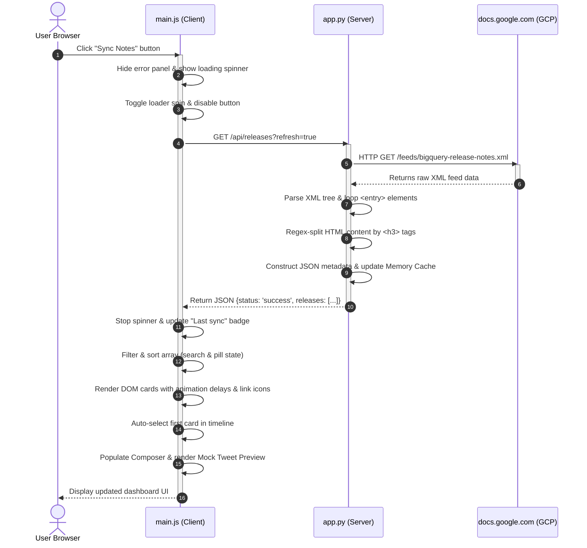

# Project Technical Deep Dive

This document provides a comprehensive breakdown of the **BigQuery Release Notes Dashboard & Tweet Composer** architecture, dividing the design into server-side and client-side responsibilities, and detailing a complete end-to-end request-response flow.

---

## 🌟 Main Features

1.  **Date-Aggregated Entry Chunking**: Resolves the limitation of standard RSS feeds where multiple distinct updates are lumped under a single date entry. Our parser slices individual `<h3>` blocks into separate, selectable cards.
2.  **In-Memory API Caching & 503 Resiliency**: Reduces external network latency and rate-limiting by caching parsed feed notes for 5 minutes (`300` seconds). If a sync fails while the cache is empty, it returns a 503 error, triggering a dedicated recovery screen with an inline retry action.
3.  **Client-Side CSV Data Exporter**: Exports the currently filtered subset of release updates directly to a CSV file (`Date, Category, Links, Content`) on the client side.
4.  **Instant Card Copies**: A copy button is added to each card. Clicking it intercepts browser propagation to prevent selecting the card, allowing users to copy card texts instantly.
5.  **Interactive Theme Switcher**: swaps the theme between light and dark using CSS custom property overrides. Preferences are saved in the user's `localStorage` cache.
6.  **Real-Time Tweeter Mockup**: Simulates the appearance of a post on X/Twitter in real-time as users edit text, utilizing zero-OAuth client intents to securely pass content.
7.  **Flexible DOM Filtering**: Instantly filters cached items dynamically across two levels: category pills and string match keywords.
8.  **Link Navigation Indicators**: Employs CSS pseudo-elements to automatically inject external link icons (`fa-up-right-from-square`) behind all links inside note cards.

---

## 🖥️ Server-Side Architecture (app.py)

The backend is a lightweight Python Flask service responsible for data acquisition, structural parsing, caching, and API routing.

### 1. Feed Fetching & Parsing Logic
- **Request Configuration**: Uses `urllib.request` with a spoofed standard `User-Agent` header to prevent Google Cloud servers from blocking automated feed scrapers.
- **XML Namespace Traversal**: The Google Cloud release notes use the standard Atom namespace (`http://www.w3.org/2005/Atom`). The script maps this namespace as `ns = {"atom": ...}` to locate `<entry>`, `<title>`, `<updated>`, and `<content>` tags.
- **HTML Splitter**: Since a single entry contains HTML representing multiple notes, the code splits the entry's HTML using the `<h3>` string identifier. Each resulting chunk is parsed:
  - The text within `<h3>...</h3>` becomes the **Category/Type** (e.g. `Feature`).
  - The remaining content is the **HTML Description**.
  - Python regex extracts documentation hyper-links `href="([^"]+)"` and strips HTML tags (`<[^>]+>`) to construct plain-text strings for the search engine and default tweet drafts.
  - A unique ID is generated for each sub-update by combining the date string with a sequence index (e.g., `June_15_2026_1`).

### 2. Caching & Error Handling
An in-memory caching mechanism stores the parsed array:
```python
CACHE_DURATION = 300  # 5 minutes
cached_releases = None
last_fetch_time = 0
```
When a client requests `/api/releases`, the server checks if `cached_releases` is populated and if `current_time - last_fetch_time < CACHE_DURATION`. If both are true (and the client didn't supply `?refresh=true`), the server bypasses the feed download and serves the local list immediately.

**503 Route Resiliency**: If a scrape fails and the cache is unpopulated (`last_fetch_time == 0`), the Flask API responds with an HTTP status `503 Service Unavailable` along with a JSON error payload:
```python
if not releases and last_fetch_time == 0:
    return jsonify({
        'status': 'error',
        'message': 'Unable to retrieve release notes. Google Cloud feeds may be offline or unreachable.'
    }), 503
```

---

## 🎨 Client-Side Architecture (Vanilla Web Tech)

The frontend is a single-page application (SPA) split into three distinct layers.

### 1. Structure (`index.html`)
- Structured with a two-column grid.
- **Header Actions**: Holds the Last Sync badge, the `#theme-toggle` switcher, the `#export-csv-btn`, and the `#refresh-btn`.
- **Left Column**: Timeline holding a loader spinner, an untracked filter empty state (`#empty-state`), a connectivity error panel (`#error-state` with retry button), and note cards.
- **Right Column**: Scroll-locked sidebar hosting the tweet textarea, progress controls, copy buttons, and the visual Twitter/X mockup card.

### 2. Style (`style.css`)
- **Theme Variables**: Utilizes CSS custom properties (`--bg-primary`, `--text-primary`, `--primary-color`) to construct a deep space slate-dark color palette.
- **Light Theme Overrides**: Implemented via a `body.light-theme` selector, swapping the variables to a high-contrast slate-light theme (Slate 50 background, White cards, and Slate 900 text). Shadows are injected dynamically for note cards and borders to add visual depth.
- **Grid Layout**: Features a responsive CSS Grid container that collapses to a single column on smaller viewports.
- **Height Lock & Scroll zones**: `.main-content` is locked with `overflow: hidden`. Height limitations and `min-height: 0` are applied to columns. This makes the `.notes-list` and the sidebar `.sticky-container` scroll independently.
- **Pseudo Icon Injections**: Inject link symbols automatically using `::after` rules:
  ```css
  .card-content a::after {
      content: " \f08e";
      font-family: "Font Awesome 6 Free";
      font-weight: 900;
      font-size: 0.75rem;
  }
  ```

### 3. Logic (`main.js`)
- **Theme Manager**: Checks `localStorage` on page load (`initTheme()`) and swaps selectors during clicks (`toggleTheme()`), updating sun/moon icons and toast prompts.
- **CSV Compiler**: `exportToCSV()` reads the filtered releases state array, converts fields to double-quoted comma-separated rows, encapsulates the result inside a `Blob` of type `text/csv`, and programs an anchor click event to download the file.
- **Card Copier**: Binds clicks on card copy icons to `copyIndividualCardText(id, event)`, invoking `event.stopPropagation()` to stop the select card event from bubble-triggering and replacing your editor's current draft.
- **State Machine**: Keeps track of search matches, pill selections, and character constraints.

---

## 🔄 Sample Request-Response Flow

This diagram illustrates what happens when a user clicks the **Sync Notes** (refresh) button:



### Detailed Trace:
1.  **Action**: The user triggers a sync. `main.js` adds `.spin-animation` to the refresh icon, disables the button, and displays the `.loading-state` spinner.
2.  **API Call**: An asynchronous `fetch('/api/releases?refresh=true')` is dispatched to the backend.
3.  **Feed Download**: The Flask endpoint detects `refresh=true`, bypasses the memory cache, and issues an HTTP request to Google Cloud to fetch the raw XML.
4.  **Parsing & Cache**: Flask parses the XML namespaces, splits the HTML elements by `<h3>`, normalizes categories, generates tweet templates, updates its global variables `cached_releases` and `last_fetch_time`, and returns a JSON payload.
5.  **DOM Assembly**: `main.js` receives the array, removes the loading indicator, and generates list items in the DOM. Each card is injected with its category badge class and receives a delayed CSS fade-in animation.
6.  **Auto-Focus**: JavaScript reads the first card ID in the array, sets `appState.selectedReleaseId`, adds the `.selected` outline class, pre-fills the textarea with the generated tweet draft, and updates the mockup layout, presenting a completed state to the user.
